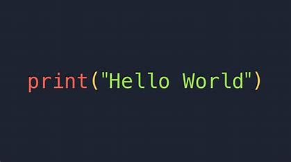

# <h1 align="center"><b>Programming and Scripting Weekly Tasks</b></h1>

This repository contains my weekly task submissions for the programming and scripting module.

Author: Niamh Hogan

## Technologies

- Python
- Cmder
- VS Code
- Git 
- GitHub
- CodeSpaces
- Notepad ++

## Week01Task - Set Up
Task Description:

Sources:

## Week02Task - Statements
Task Description:

Tech Used:
Sources:

## Week03Task - Variables
Task Description:

Tech Used:
Sources: https://www.w3schools.com/python/ref_string_replace.asp; https://www.w3schools.com/python/python_strings_slicing.asp

## Week04Task - Flow
Task Description:

Tech Used:
Sources: Source: https://stackoverflow.com/questions/53345214/how-to-print-a-collection-of-characters-next-to-each-other/53345233#53345233

## Week05Task - Data Structures
Task Description:

Tech Used:
Sources: https://chatgpt.com/share/67c48614-133c-8011-97f4-d427a4568b8a

## Week06Task - Functions
Task Description:

Tech Used:
Sources:

## Week07Task - Files
Task Description:

Chat GPT:

> "The purpose of a program that takes a filename from an argument on the command line is to allow users to specify which file the program should process without modifying the program's code. This approach provides flexibility and automation, especially in command-line environments."

https://chatgpt.com/c/67e01176-aaac-8011-8e6a-a10c63cb4844

Tech Used:
Sources:

## Week08Task - Plotting

Matplotlib & Numpy
