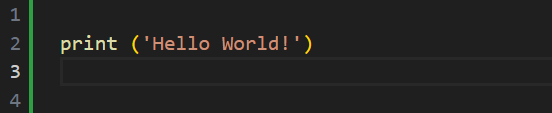

# Programming and Scripting Weekly Tasks

## Overview

This repository contains my 8 weekly task submissions as part of the assessment for the Programming and Scripting module at Atlantic Technological University - Galway.

As a novice, the purpose of the weekly tasks was to improve on my ability to code in Python by solving my own solutions to problems that I had yet encountered.

Author: Niamh Hogan

## About this Repository

This repository is comprised of the following files and folders:

* A **README** file that contains what problem each program solves, list of dependencies, how to: set up environment, download the repository & run the code.
* An **images** folder that contains a .png file of a screenshot taken from my first Hello World program.
* **Week01Task** - **week08Task** Folders  
  - Each folder contains a .py file containing the weekly task.  
  - Each .py file contains a brief description of the program, python code, comments that provide a detailed explanation of the code & references.  
  - The **week07Task** folder additionally contains a .txt file of the full novel *Brave New World*.  
  - The **week08Task** folder also contains a .png file of the generated histogram.
* A **requirements.txt** file containing all the Python packages that the programs depend on & their versions.

## Features

The programs located in this repository execute the following tasks:

**helloworld.py**  
Prints out 'Hello World!' when run.

**bank.py**  
Asks the user to input two amounts in cent. It then prints out the sum of these with a euro sign 
and decimal point between the euro and cent of the amount.

**accounts.py**  
The following programs are useful as they can be used to mask account numbers for security purposes.
  - The first program reads in a 10 character account number and outputs the account number with only the last 4    digits showing and the first 6 digits replaced with Xs.  
  - The second program deals with account numbers of any length and outputs the account number with the last 4 digits displayed and the rest replaced with Xs.

**collatz.py**  
Asks the user to input any positive integer and outputs the successive values of the following calculation:  
  *Calculate the next value by taking the current value and, if it is even, divide it by two, if it is odd, multiply it by three and add one.* 
  - The program ends if the current value is one and prints an error message if the input is not a positive integer.

**weekday.py**  
Outputs whether or not today is a weekday without user input.

**squareroot.py**  
Creates a function that takes in a positive floating-point number (float) as input and outputs an approximation of it's square root utilizing the Newton method.  
  - The program returns a ValueError if the input is a negative number.

**es.py**  
This program reads in a text file and outputs the amount of 'e' & 'E's' it contains.  
  - The program takes the filename from an argument on the command line.  
  - The program reads the file in utf-8 encoding to avoid any encoding errors. The program also deals with the following errors:  
  - no argument, filename that does not exist, or is not a text file, and any other unexpected errors.

**plottask.py**  
This program creates & displays a histogram of a normal distribution with 1000 values that have a mean=5 and Standard deviation (SD)=2 and a plot of the function, h(x)=x3, in the range 0 - 10, on the one set of axes. 

## Dependencies

* Python==3.12.7  
  - os  
  - sys  
  - datetime  
* matplotlib==3.9.2  
* numpy==1.26.4

## Environment Setup

**Git**  
Download the latest version of Git at:  
https://git-scm.com/downloads

**GitHub**  
Create a free GitHub account at:  
https://github.com/signup?ref_cta=Sign+up&ref_loc=header+logged+out&ref_page=%2F&source=header-home

**Anaconda**  
I would recommend using Anaconda as it comes bundled with Python==3.12.7 & the Python libraries necessary to run the code in this repository.  
Install Anaconda using the following steps:  
1. Download Anaconda from:  
https://www.anaconda.com/download
2. Open the downloaded file & press next, next
3. When the advanced options appear check the following boxes:  
  - Add to PATH environment variable  
  - Make this version your default Python

**Visual Studio Code**
Download Visual Studio Code at:  
https://code.visualstudio.com/Download

## How to Download Repository  

You can clone this repository to VS Code using the following steps:
1. Copy the repositories URL:  
https://github.com/NibnabCodes/pands_weekly_tasks  
2. Create a folder in VS Code of where you want to store the cloned repository
3. Open new terminal in VS Code & input following:  
  - git clone PASTED.URL - To clone repository  
  - git config pull.rebase false - Set pull mode to merge  
  - git pull - To pull the content of the repository  

The repository should now be accessible in VS Code & ready to execute.

## How to Run the Code  

To run the code in VS Code follow these steps:  

1. Open Terminal & input the following commands:  
2. cd followed by the folder that the repository is stored in.
3. cd pands_weekly_tasks - To access repository  
4. cd to required folder & input python .py  
  - For example: cd week01Task python helloworld.py  
5. To run week07Task es.py:  
  - enter: python es.py "Brave New World Full Text.txt" on the command line
6. To move between folders in the repository:  
  - cd .. - To go up one directory. Each .. moves you up one directory
  - cd ..//.. - To go up two directories

